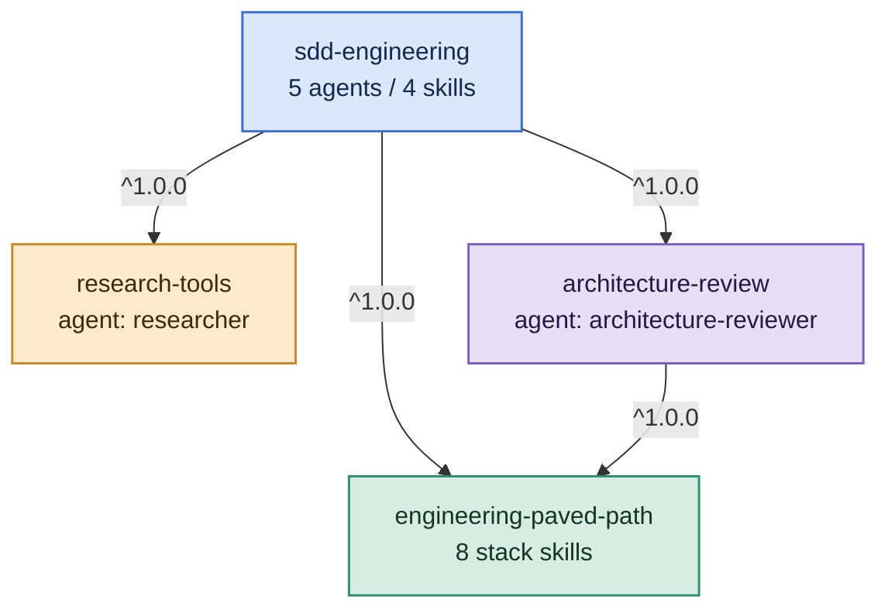
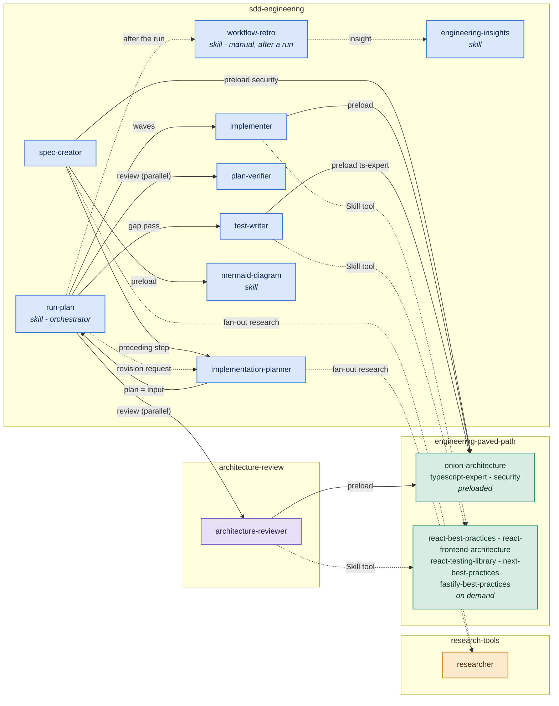

# Plugin dependency graph

How the plugins in this marketplace relate to each other: what each one declares
in its manifest, and how they compose at runtime into the spec-driven
development (SDD) workflow.

## Declared dependencies (`plugin.json`)

Arrows point from the dependent plugin to its dependency; edge labels are the
semver ranges from the `dependencies` field.



Claude Code resolves and installs these dependencies automatically, listing what
it added at the end of the install output. Installing the top of the graph is
enough — there is no dependency order to follow:

```
/plugin marketplace add SyukPublic/ai-dev-toolkit
/plugin install sdd-engineering@ai-dev-toolkit
```

The ranges resolve against this repository's release tags
(`<plugin-name>--vX.Y.Z`, see [RELEASES.md](RELEASES.md)), so each dependency is
fetched at the highest tagged version satisfying `^1.0.0`. Enabling a plugin
enables its dependencies too, and disabling one is refused while another enabled
plugin still needs it. To install a single leaf plugin on its own, name it
directly — `/plugin install research-tools@ai-dev-toolkit`.

## Runtime composition

Who spawns whom, and which skills each agent loads. Solid arrows are agent
spawns and frontmatter skill preloads; dotted arrows are on-demand or manual
steps. Cross-plugin skills are invoked in the namespaced form, e.g.
`engineering-paved-path:security`.



Reading the graph:

- **`run-plan` is the orchestration hub** — it drives the implementation waves,
  the test gap pass, and the parallel review stage, and can send the plan back
  to `implementation-planner` for a split when a phase is oversized.
- **`researcher` serves the early stages** — `spec-creator` and
  `implementation-planner` fan out fact-finding to it instead of doing long
  searches in their own context.
- **`engineering-paved-path` splits into two tiers**: a core tier
  (`onion-architecture`, `typescript-expert`, `security`) preloaded by agents
  at spawn time via the `skills:` frontmatter, and a surface tier
  (React / Next.js / Fastify / testing) loaded on demand via the `Skill` tool
  only when an agent touches that surface. This keeps agent contexts lean.
- **`workflow-retro` sits outside the pipeline** — the user invokes it manually
  after a run; confirmed non-obvious findings flow into the host project's
  insights file via `engineering-insights`.

## Summary

Versions are deliberately absent here — they live only in each plugin's
`plugin.json`, and a number repeated in prose goes stale on the next release.
Read the current one from the manifest, or from `/api/index.json` on the
[catalog site](https://syukpublic.github.io/ai-dev-toolkit/).

| Plugin | Contents | Depends on |
| ------ | -------- | ---------- |
| [engineering-paved-path](../plugins/engineering-paved-path/README.md) | 8 skills: react-best-practices, react-frontend-architecture, react-testing-library, next-best-practices, fastify-best-practices, onion-architecture, security, typescript-expert | — |
| [research-tools](../plugins/research-tools/README.md) | `researcher` agent (read-only: code, config, git, web) | — |
| [architecture-review](../plugins/architecture-review/README.md) | `architecture-reviewer` agent (read-only layering/boundary audit) | engineering-paved-path `^1.0.0` |
| [sdd-engineering](../plugins/sdd-engineering/README.md) | agents: spec-creator, implementation-planner, implementer, test-writer, plan-verifier; skills: run-plan, workflow-retro, engineering-insights, mermaid-diagram | all three `^1.0.0` |

Related conventions:

- Skills are invoked across plugins in the namespaced form
  `<plugin-name>:<skill-name>`.
- Supporting scripts inside skills resolve via `${CLAUDE_SKILL_DIR}`, never via
  repo-relative paths.
- Versions live only in each plugin's `plugin.json` (see
  [RELEASES.md](RELEASES.md)); merging a version bump to `main` creates the
  `<plugin-name>--vX.Y.Z` tag automatically. Note the **two** hyphens before the
  `v`: that is the form the ranges above resolve against, and a single-hyphen tag
  is invisible to dependency resolution.
