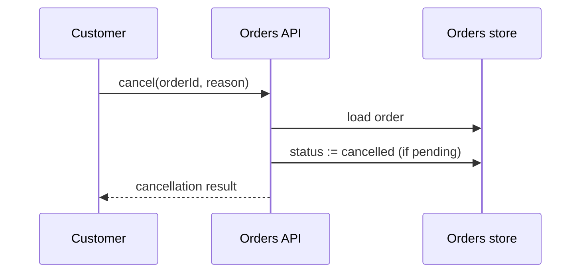

# Spec: Order cancellation | Spec ID: SPEC-2026-07-10-order-cancellation | Status: draft
Supersedes: — | Superseded by: —

## Problem & context
Customers currently have no way to cancel an order after placing it; support
staff cancel orders manually in the database. This feature adds self-service
cancellation for orders that have not yet shipped, with an auditable reason.

## Goals / Non-goals
Goals (must-have):
- A customer can cancel their own order while it is still `pending`.
- An admin can see who cancelled an order and why.
- The customer is notified when their cancellation succeeds.

Non-goals:
- Refund processing (separate feature).
- Cancelling orders that have already shipped.

## User stories
- US-1: As a customer, I can cancel my pending order so that I am not charged
  for something I no longer want.
- US-2: As an admin, I can see the cancellation reason and actor on a
  cancelled order so that support disputes are auditable.
- US-3: As a customer, I receive a confirmation notification when my
  cancellation succeeds so that I know the order will not ship.

## Design analysis
No design sources exist for this feature — it is an API-level change plus a
notification; there are no new screens, so there is no screen/state inventory
and no design gap sweep.

## Acceptance criteria (EARS)
- AC-1 [Event-driven] WHEN a customer requests cancellation of their own order
  and the order status is `pending`, the system shall set the order status to
  `cancelled` and record the actor and reason.
- AC-2 [Unwanted behavior] IF a customer requests cancellation of an order
  that is not `pending`, THEN the system shall reject the request and leave
  the order unchanged.
- AC-3 [Unwanted behavior] IF a customer requests cancellation of an order
  they do not own, THEN the system shall reject the request without revealing
  whether the order exists.
- AC-4 [Event-driven] WHEN an admin opens a cancelled order, the system shall
  display the cancellation actor, reason, and timestamp.

## Edge cases
- Concurrent cancellation and shipment: the status is re-checked at
  cancellation time — covered by AC-2.
- Cancellation without a reason: reason is optional free text — covered by
  AC-1 (reason may be empty).
- Repeated cancellation of an already-cancelled order: covered by AC-2.

## Workflows & service communication

The customer calls the orders API, which re-checks the order status before
writing the cancellation, so an order that already shipped can never be
cancelled.

## Contracts (shape-level)
Cancellation request:
| Field | Type | Semantics |
|---|---|---|
| orderId | string | required; must reference an order owned by the caller |
| reason | string | optional; free text, max 500 chars |

Order (changed fields):
| Field | Type | Semantics |
|---|---|---|
| status | enum | existing enum gains `cancelled` (terminal) |
| cancelledBy | string | set only when status = `cancelled` |
| cancelledAt | timestamp | set only when status = `cancelled` |
| cancellationReason | string | optional; empty allowed |

## Non-functional
- Performance: N/A — cancellation is a single-order write on the existing API
  budget; no new hot path.
- Security: only the order owner (or an admin) may cancel; ownership is
  enforced without leaking order existence (AC-3).
- Accessibility: N/A — no new UI in this feature.
- i18n: the confirmation notification reuses the project's existing message
  templates — no new locale dimension.

## Inputs (provenance)
- [deterministic: codebase inspection] — orders module routes and service
  (server/src/modules/orders/).
- [reused: none — no prior spec covers cancellation]

## Untrusted inputs
- `reason` free text from the customer: stored and displayed as data, never
  interpreted; length-capped per the contract.

## Dependencies & impacts
- Orders module (server/src/modules/orders/): status enum gains a terminal
  value; a cancellation endpoint is added.
- Notification delivery: the existing notification mechanism sends the
  cancellation confirmation (US-3).

## Traceability
| AC | Story | Design ref | Verification | Plan phase |
|---|---|---|---|---|
| AC-1 | US-1 | — | integration: cancel a pending order, assert status + audit fields | — |
| AC-2 | US-1 | — | integration: cancel a shipped order, assert rejection and unchanged order | — |
| AC-3 | US-1 | — | integration: cancel another customer's order, assert opaque rejection | — |
| AC-4 | US-2 | — | e2e: admin opens a cancelled order, sees actor/reason/timestamp | — |
