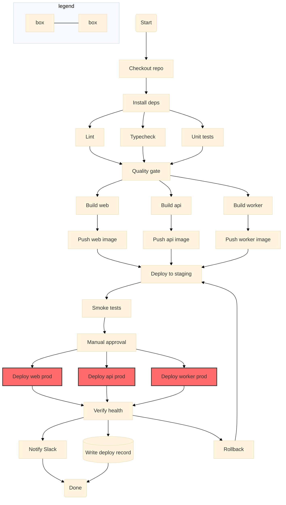

```mermaid
flowchart TD
  %%{init: {'theme': 'base'}}%%
  start(Start) --> checkout[Checkout repo]
  checkout --> install[Install deps]
  install --> lint[Lint]
  install --> types[Typecheck]
  install --> unit[Unit tests]
  lint --> gate1[Quality gate]
  types --> gate1
  unit --> gate1
  gate1 --> buildWeb[Build web]
  gate1 --> buildApi[Build api]
  gate1 --> buildWorker[Build worker]
  buildWeb --> pushWeb[Push web image]
  buildApi --> pushApi[Push api image]
  buildWorker --> pushWorker[Push worker image]
  pushWeb --> stageDeploy[Deploy to staging]
  pushApi --> stageDeploy
  pushWorker --> stageDeploy
  stageDeploy --> smoke[Smoke tests]
  smoke --> approval[Manual approval]
  approval --> prodWeb[Deploy web prod]
  approval --> prodApi[Deploy api prod]
  approval --> prodWorker[Deploy worker prod]
  prodWeb --> verify[Verify health]
  prodApi --> verify
  prodWorker --> verify
  verify --> notify[Notify Slack]
  verify --> metrics[(Write deploy record)]
  notify --> done(Done)
  metrics --> done
  rollback[Rollback] --> stageDeploy
  verify --> rollback
  subgraph legend
    direction LR
    l1[box] --- l2[box]
  end
  smoke ~~~ approval
  style prodWeb fill:#ff6b6b,stroke:#333,stroke-width:2px
  style prodApi fill:#ff6b6b,stroke:#333,stroke-width:2px
  style prodWorker fill:#ff6b6b,stroke:#333,stroke-width:2px
```
