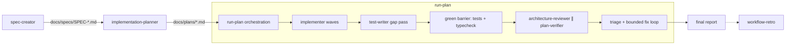

# sdd-engineering

Spec-driven development (SDD) workflow for Claude Code: spec → plan → implement → verify → retro. The plugin ships the workflow agents and the orchestration/retro skills; stack-specific engineering skills and the read-only review/research agents come from its dependency plugins.

## The SDD pipeline



1. **`spec-creator`** turns a feature request into a reviewable spec (default convention: `docs/specs/SPEC-<feature>.md`).
2. **`implementation-planner`** turns an approved spec into a phased Development Plan with a traceability matrix (default convention: `docs/plans/<feature>.md`).
3. **`run-plan`** (skill) executes an approved plan end-to-end: parallel `implementer` waves per phase → one `test-writer` gap pass → a green barrier (tests + typecheck must pass) → parallel read-only review by `architecture-reviewer` and `plan-verifier` → a bounded fix loop (max 2 iterations) → a final report. It never commits, pushes, or opens PRs.
4. **`workflow-retro`** (skill) measures how the run actually went — true token/tool/duration/parallelism metrics from session journals — and turns findings into concrete optimization actions.

## Quick start — one feature end to end

With this plugin and its three dependencies installed:

1. **Spec.** Ask for a spec; answer the interview questions (or front-load the decisions to skip the round-trip):

   > Create a spec for CSV export of the orders table. Decisions: async export with email link, max 100k rows, admin-only.

   `spec-creator` writes `docs/specs/SPEC-<date>-csv-export.md` and stops while open questions remain — a final spec has zero.

   Design sources go in **by path**: `spec-creator` copies every file you name into the spec's own folder, `docs/specs/assets/<spec-id>/`, and cites it from there, so the spec stays readable after the original moves. It cannot see images pasted or dropped into the chat — a subagent receives text only — so give it a path for anything that must land in the repository, and verbalize the rest.

2. **Plan.** Point the planner at the approved spec and state the execution mode up front:

   > Plan the feature from docs/specs/SPEC-2026-07-17-csv-export.md, multi-agent execution.

   `implementation-planner` writes `docs/plans/csv-export.md` — phased, with disjoint scopes and a traceability matrix.

3. **Run.** Start from a clean working tree (the skill stops on a dirty one), then:

   ```
   /sdd-engineering:run-plan docs/plans/csv-export.md
   ```

   The orchestrator spawns implementer waves, the test gap pass, the green barrier, the parallel review, and the bounded fix loop, then reports. It never commits — review the diff and commit/PR yourself.

4. **Retro (optional).** After the run, in the same project:

   ```
   /sdd-engineering:workflow-retro
   ```

   You get real token/duration/parallelism metrics per agent plus concrete optimization actions; confirmed non-obvious findings go to `docs/engineering-insights.md` via `engineering-insights`.

Steps 1–2 are also useful standalone: a spec for alignment, a plan for a human implementer. And `run-plan` accepts any plan file that matches its structure gate, wherever it lives.

## Components

### Agents (5)

| Agent | Role |
|---|---|
| `spec-creator` | Produces the feature spec from a request; stages user-provided design sources into `<specs-dir>/assets/<spec-id>/`; preloads `sdd-engineering:mermaid-diagram` for diagrams |
| `implementation-planner` | Produces the phased Development Plan + traceability matrix from a spec |
| `implementer` | Implements one plan phase (code + targeted tests) inside its disjoint scope |
| `test-writer` | Post-implementation gap pass: writes only the missing/thin tests from the traceability matrix |
| `plan-verifier` | Read-only audit of the implementation against the plan; returns the RTM with verdicts |

### Skills (4)

| Skill | Purpose |
|---|---|
| `run-plan` | Orchestrates the whole pipeline over one approved plan (hard gate: plan file required) |
| `workflow-retro` | Post-run retrospective: journal-based metrics, insights, trend ledger |
| `engineering-insights` | Captures durable, non-obvious engineering knowledge into the host project's insights file |
| `mermaid-diagram` | Mermaid diagram authoring guide + templates (supporting skill) |

## Dependencies

Claude Code resolves the `dependencies` field in `plugin.json` and installs all three for you, listing what it added at the end of the install output. One command is enough:

```
/plugin install sdd-engineering@ai-dev-toolkit
```

| Dependency | Provides | Used by |
|---|---|---|
| `engineering-paved-path` (`^1.0.0`) | Stack skills: React/Next/Fastify best practices, onion architecture, testing, security, TypeScript | `implementer`, `architecture-reviewer`, spawn prompts |
| `research-tools` (`^1.0.0`) | `researcher` agent (read-only codebase/web research) | planning and spec stages |
| `architecture-review` (`^1.0.0`) | `architecture-reviewer` agent | `run-plan` Stage 4 review |

Without them, `run-plan` cannot spawn `architecture-reviewer`/`researcher`, and the implementer agents lose their paved-path skills.

## Required inputs

- **`run-plan` requires an existing, approved plan file** — this is a hard gate: no plan, no run. Produce one with `implementation-planner` first and pass its path explicitly.
- `workflow-retro` needs session journals on the machine where the run happened (deep mode); otherwise it falls back to labeled lower-bound in-context estimates.

## Path conventions (defaults — every one overridable by the caller)

| Artifact | Default convention |
|---|---|
| Specs | `docs/specs/SPEC-<feature>.md` |
| Plans | `docs/plans/<feature>.md` |
| Retro reports + ledger | `docs/retros/` |
| Engineering insights log | `docs/engineering-insights.md` |

These are conventions of the skills, not hard requirements: pass an explicit path (spec path, plan path, retro dir, insights file) in the invocation to override any of them. Test/typecheck commands and environment constraints always come from the host project's `CLAUDE.md`.

## What this plugin executes

- `run-plan` spawns subagents (write access within the plan's scope) and runs the host project's test/typecheck commands. It never commits, pushes, publishes, or runs database migrations — migrations are only ever flagged for the user.
- `workflow-retro` runs a bundled read-only Python script (`skills/workflow-retro/scripts/retro_metrics.py`, stdlib only) that parses Claude Code session journals under `~/.claude/projects/` and prints JSON metrics; it writes reports only under the retro directory.
- `engineering-insights` writes only to the host project's insights file.
- `mermaid-diagram` executes nothing; it optionally suggests the `mmdc` CLI if you have it.

## Versioning

SemVer per [RELEASES.md](https://github.com/SyukPublic/ai-dev-toolkit/blob/main/docs/RELEASES.md); release notes in [CHANGELOG.md](CHANGELOG.md). The dependency and runtime-composition graph for the whole plugin set: [docs/DEPENDENCIES.md](https://github.com/SyukPublic/ai-dev-toolkit/blob/main/docs/DEPENDENCIES.md).
